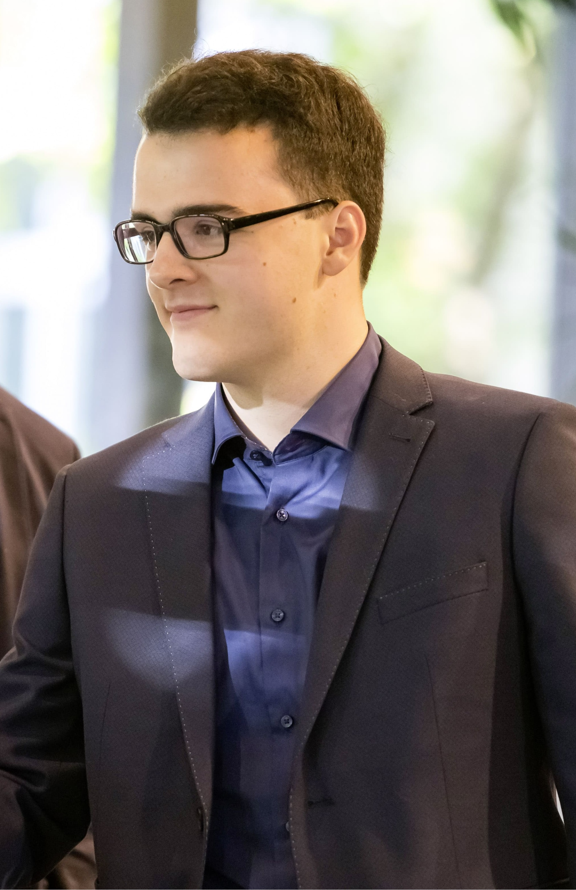

# Hi there, I'm Christian Korreng 👋

### A Student of Games and Immersive Media at Hochschule Furtwangen.
#### I am currently a student at Hochschule Furtwangen (HFU), pursuing a degree in Games and Immersive Media. My passion lies in creating engaging interactive experiences, from video games to virtual reality applications. I am always eager to learn new technologies and apply my skills to build the digital worlds of the future.
--------------------------------------------------------------------
### 🔧 Tech Stack & Tools: Here are a few technologies I've been working with recently:

Frontend: HTML, CSS, JavaScript 

Game Development: Unreal Engine 5

Design: Blender, Asprite, Substance Painter

Tools: Git, GitHub, Visual Studio Code

---------------------------------------------------------------------------------------------
### 🚀 My Projects
Here's some of the work I'm most proud of.

Project Name

Description

Links
-------------------------------------------------------------------------
### 📫 Get In Touch
Have a question or want to work together? Feel free to reach out!

