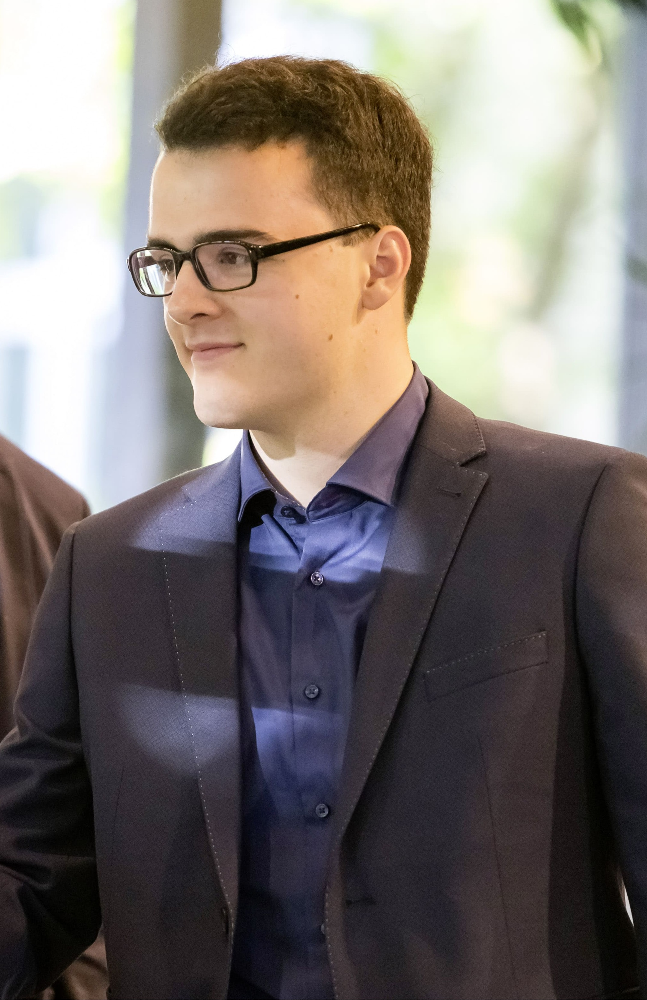

# Hi there, I'm Christian Korreng 👋

### 🌐 **[View my portfolio site →](https://th3d0c0.github.io/Christian-Korreng-Portfolio/)**
The source for that site lives in this repository and is published with GitHub Pages from the `main` branch.

### A Student of Games and Immersive Media at Hochschule Furtwangen.
#### I am currently a student at Hochschule Furtwangen (HFU), pursuing a degree in Games and Immersive Media. My focus is on graphics programming, 3D art and game audio — from writing renderers from scratch, to building environments in Blender, to scoring the games I work on.
--------------------------------------------------------------------
### 🔧 Tech Stack & Tools: Here are a few technologies I've been working with recently:

Languages: C++, C, GDScript (Godot), Java Script, Blueprints (Unreal Engine)

Game Development: Godot, Unreal Engine 5

Graphics: OpenGL, assimp, Dear ImGui

Art: Blender, Substance Painter, Aseprite

Audio: Ableton Live

Tools: Git, GitHub, Visual Studio Code

---------------------------------------------------------------------------------------------
### 🚀 My Projects
Here's some of the work. My [portfolio site](https://th3d0c0.github.io/Christian-Korreng-Portfolio/) covers each of these in more detail, with screenshots, audio samples and a 3D model viewer.

#### ***Custom 3D Rendering Engine:***  
https://github.com/Th3D0c0/OpenGL_Learning  
A 3D rendering engine written in C++ with OpenGL. Phong and experimental Forward+ lighting, a Marching Cubes planet generator, shader permutation, a particle system using spatial partitioning, asset importing with assimp and a Dear ImGui interface.

#### ***Rasterfari:***  
https://github.com/Th3D0c0/RasterFari  
A software rasterizer written in C. Triangle rasterization using barycentric coordinates and line rasterization using the Bresenham algorithm, drawn straight into a colour buffer.

#### ***Sound 1 Project:***  
https://th3-d0c.itch.io/sound-1-project  
A small game made in Godot for the Sound 1 module, where the focus was the music, sound effects and ambience rather than the gameplay systems.

#### ***Project 3:***  
https://th3-d0c.itch.io/project-3  
The end assignment of the Project 3 course, made in a team of four. I created the visual assets and environments in Blender, along with the title screen and the music.

#### ***Geometry Survivor:***  
https://th3-d0c.itch.io/geometry-survive  
A survivor-like game built in Unreal Engine in two weeks with a team of four. I worked on the initial map design, enemy logic, spawn systems, the boss and the UI logic.

#### ***Industry Workflows:***  
Ongoing self-directed study of industry practices — trim sheet workflows, character creation, modular environment creation and vertex painting.

-------------------------------------------

### 📫 Get In Touch
Have a question or want to work together? Feel free to reach out!

